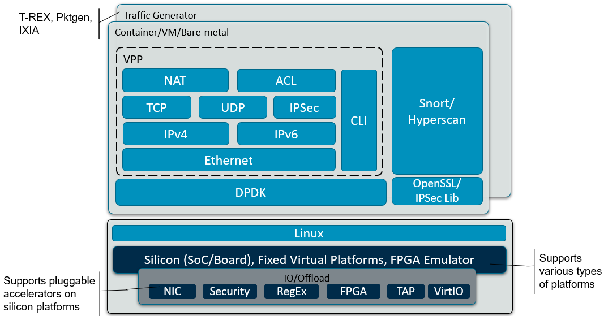

..
  # Copyright (c) 2022, Arm Limited.
  #
  # SPDX-License-Identifier: Apache-2.0

########
Overview
########

************
Introduction
************

The Dataplane Stack provides users with solution reference
implementations of high performance user space networking functionalities
which would run on various Arm platforms.

End users interested in running these networking functions on Arm servers
may include networking software developers, Arm partners and their customers,
CPU performance analysts, CPU designers, and marketing team.

Target Platforms
~~~~~~~~~~~~~~~~

Supported platforms
-------------------

Current use cases have been validated in Ubuntu 20.04 distro on below
machines:

  * Ampere Altra (Neoverse-N1)

Future Platforms
----------------

The solutions will be ported to more platforms in the future. The planned
platform includes:

* More silicon platforms - e.g., Neoverse-N2 server or embedded level CPUs,
  mainly focus on network functions and performance on Arm CPUs.

* Fixed Virtual Platforms - FVP are complete simulations of an Arm system,
  including processor, memory and peripherals. These are set out in a
  "programmer's view", which gives a comprehensive model on which to
  build and test users' software. FVP mainly focuses on verifying
  network functions and CPU behavior analysis in the early IP design stage.

* FPGA Emulator - RTL based CPU IP system emulator, mainly focuses on verifying
  network functions, performance benchmarking and CPU behavior analysis in
  the pre-silicon SOC design verification stage.

*********************
Solution Architecture
*********************

   Dataplane Stack solution architecture

This software mainly focuses on the dataplane network, as performance is of
the primary concerns in dataplane implementation on COTS servers, e.g.,
Ampere Altra, AWS Gravition3, Alibaba Yitian 710.

This project provides the networking functionalities based on some well-known
userspace network open source projects:

* `DPDK <https://www.dpdk.org/>`_:
  acronym of Data Plane Development Kit (DPDK), mostly runs in user space.
  It comprises of libraries to achieve high I/O performance and reach high
  packet processing rates, which are some of the most important features in
  the networking area. It supports multivendors and architectures, and runs
  on variety of CPU architectures, e.g., Arm, Power, x86.
  DPDK was created for the telecom/datacom infrastructure,
  but today, it's used almost everywhere, including the cloud, data centers,
  appliances, containers and more.

* `VPP <https://fd.io/>`_:
  acronym of Vector Packet Processor (VPP), is a fast and scalable layer
  2-4 multi-platform network stack that provides out-of-the-box production
  quality switch/router functionality. It runs in Linux user space on multiple
  architectures including ARM, Power and x86 architectures.
  The benefits of this implementation of VPP are its high performance, proven
  technology, its modularity and flexibility, and rich feature set.

* `Snort <https://www.snort.org/>`_:
  is the foremost Open Source Intrusion Prevention System (IPS)
  in the world. Snort IPS uses a series of rules that help define malicious
  network activity and uses those rules to find packets that match against
  them and generates alerts for users.

*********
Use Cases
*********

Supported Usecases
~~~~~~~~~~~~~~~~~~

Currently, below usecase/features have been implemented and supported:

* VPP based IPv4 forwarding

* DPDK L3fwd based IPv4/IPv6 forwarding

Future Usecases
~~~~~~~~~~~~~~~

The solutions will gradually expand with more functions and features.

The functions below are classified from functionality perspective, instead of
from software component or implementation perspective. For example, IPv4
routing function could be implemented using VPP L3 or DPDK L3 features, and
the firewall function could be provided using VPP ACL/Classifier or Snort3.
Certain use case has a large scope and may be implemented with multiple
software components and instances.

The implementation mechanism of each network function below will be described
in detail in later chapters in this documentation.

* **L2 Switching**

  This is a typical L2 network function, including MAC learning, bridging,
  cross-connect, flooding, VLAN, etc.

* **IPv4 Routing**

  Forward packets to the next-hop IP by looking up the destination IP in the packets.

* **IPv6 Routing**

  IPv6 is almost identical to IPv4 routing under CIDR. The major difference
  is the addresses are 128-bit IPv6 addresses instead of 32-bit IPv4
  addresses.

* **NAT**

  Network Address Translation (NAT) is a method of mapping an IP address
  space into another by modifying network address information in the IP
  header of packets while they are in transit across a traffic routing
  device. This software covers the basic NAT functions, e.g., SNAT, DNAT.

* **VxLAN**

  Virtual eXtensible Local Area Network (VXLAN) is an encapsulation protocol that provides data center connectivity.
  It uses tunneling to stretch Layer 2 connections over an underlying Layer 3
  network. In data centers, VXLAN is the most commonly used protocol to
  create overlay networks that sit on top of the physical network, enabling
  the use of virtual networks.

* **IPSec**

  Internet Protocol Security (IPSec) is a framework of techniques used to
  secure the connection over the network communication. The typical
  encryption/decryption algorithms are covered in the implementation.

* **Firewall**

  A firewall is a network security device that monitors incoming and outgoing
  network traffic and permits or blocks data packets based on a set of
  security rules. The typical security applications are demonstrated
  based on some VPP and Snort3 security implementations.

* **TCP Termination**

  This function is primarily based on VPP host-stack, and we investigate
  the implementations with some other open source TCP/IP user software.

* **SSL Proxy**

  The SSL proxies control Secure Sockets Layer – SSL traffic -to ensure
  secure transmission of data between a client and a server. The SSL
  proxy is transparent, which means it performs SSL encryption and
  decryption between the client and the server.

* **Wireless Mid-haul or Back-haul**

  Backhaul is better known than fronthaul. It refers to the connections
  between a mobile network and a wired network that backhaul traffic from
  disparate cell sites to a mobile switching telephone office.

***********************
Implement Consideration
***********************

This software aims to provide high-throughput packet processing software
stack and solutions to solve customer and partner use case in networking
applications. There are several considerations from technical perspective
in the implementation process:

* **Integrate DPDK, VPP and SNORT/Hyperscan**

  As mentioned above, this software provides network functions based on
  some open source projects, e.g., DPDK, VPP, Snort3 and scripts
  to combine them together for a complete solution.

* **Execute on Arm**

  The software is mainly implemented, validated, optimized and deployed on
  Arm AArch64 architecture and platforms. The target platforms are listed
  in later section.

* **Optimize for Arm architectures**

  Some of above open source projects are well-supported in community,
  including arch-specific compilation, community CI/CD, distro packages,
  arch-specific optimization, etc. While some of the projects are yet to be
  supported.

  That's why the software has developed some scripts to resolve compilation
  issues on Arm platforms, compile project source code with arch-specific
  features, apply optimization patches done by Arm OSS Networking, deploy
  optimal parameters tuned for specific Arm platforms, etc.

* **Integrate security libraries, e.g., OpenSSL, IPSec**

  A group of protocols are supported in established use cases to set up
  encrypted connections with the typical security libraries between devices.
  It helps keep data sent over public networks secure.

* **Support hardware offloads**

  The solution supports use cases that allow to offload some router features
  onto the underneath hardware. This allows reaching wire speeds when routing
  packets, which simply would not be possible with the CPU.

* **Validate with multiple traffic generator**

  Currently, quickstart and user guide use IXIA traffic generator to validate
  solution use cases. Some software packet generators are planned to be
  supported and provided along with the solution software in the future, e.g.,
  `TRex <https://trex-tgn.cisco.com/>`_,
  `DPDK Pktgen <https://pktgen-dpdk.readthedocs.io/en/latest/>`_,
  `Scapy <https://scapy.net/>`_.

********
Purposes
********

The network functions that the project provided serves multiple purposes of:

* Showcase the integration of various components and act as poof of concept
  to all stakeholders who cares about network function feasibility on Arm.

* Allow for performance analysis/optimization with a solution that is close
  to customers' production deployment.

* Provide customers with a out-of-the-box reference design for rapid design
  modeling.

********************
Repository Structure
********************

The code repository are stored in Arm GitLab arm-reference-solutions group,
with the link, https://gitlab.arm.com/arm-reference-solutions/dataplane-stack.

::

  ├── CHANGELOG.rst - Change notes for each releases
  ├── doc           - Sphinx based documents
  ├── LICENSE.rst   - License file of this project
  ├── MAINTAINERS   - Maintainer recording of specific module/use-cases
  ├── Makefile      - Compiling various components and documentation
  ├── setup.sh      - Script to set up use case environment
  ├── README.md
  └── tools         - Tools used to manage the project

*******
License
*******

The software is provided under an Apache 2.0 license (more details in
`Apache 2.0 <https://www.apache.org/licenses/LICENSE-2.0>`_
).

Contributions to the project should follow the same license.

*************
Contributions
*************

This project has not put in place a process for contributions currently.
While proposals on new features, new use-cases or any improvement are welcome
always. You are welcome to create Merge-Requests in project's Gitlab
repository
`dataplane-stack <https://gitlab.arm.com/arm-reference-solutions/dataplane-stack>`_
to demonstrate your ideas and suggestions. We will sincerely investigate your
proposals and provide feedback to you.

For bug reports, please submit an Issue via GitLab repository
`dataplane-stack <https://gitlab.arm.com/arm-reference-solutions/dataplane-stack>`_.
Please provide as much information as possible:

  * Hardware information, including details on CPU, server, memory, disk,
    NIC, etc.
  * System configuration, like distro type and version, kernel version,
    command line parameters, NUMA, huge-page setting
  * Tools, e.g., compiler version, script tool version
  * Use case topology and testing method

********************
Feedback and Support
********************

To provide feedback or to request support, please contact project maintainer
by email at Lijian Zhang <Lijian.Zhang@arm.com>, or check 'MAINTAINERS' file
in top directory of repository for module/feature/use-case specific maintainers.

Arm licensees may also contact Arm via their partner managers to request support.
