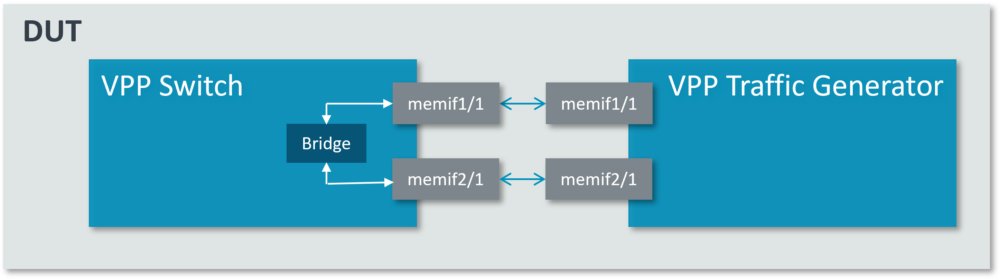
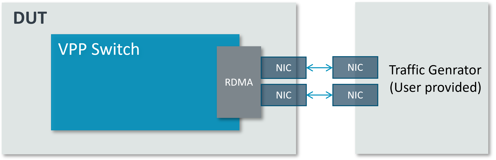

..
  # Copyright (c) 2023, Arm Limited.
  #
  # SPDX-License-Identifier: Apache-2.0

################
VPP L2 Switching
################

************
Introduction
************

VPP L2 Switching implements the typical switching function based on 48-bit MAC
address. It forwards packets based on the l2fib table. Below L2 features are supported:

- Forwarding
- Mac Learning
- Flooding

The l2fib table starts out empty. Table entry can be manually configured as a static entry.
VPP switch can also dynamically populate its l2fib table by looking at the source MAC
address of incoming frames
on each interface.

This guide explains in detail on how to use the VPP based L2 Switching using either RDMA or MEMIF interfaces.
Other interfaces supported by VPP(e.g. DPDK or VETH) should follow a similar setup,
but are not covered in this guide. Users can utilize scripts in dataplane-stack repo
to run cases quickly, or use detailed command lines in this guide to run cases step by step.

First, ensure the proper VPP binary path. To use VPP built in dataplane-stack, run::

        export vpp_binary="<nw_ds_workspace>/dataplane-stack/components/vpp/build-root/install-vpp-native/vpp/bin/vpp"
        export vppctl_binary="<nw_ds_workspace>/dataplane-stack/components/vpp/build-root/install-vpp-native/vpp/bin/vppctl"

To use package intsalled VPP (e.g. ``apt``, ``buildroot``), run::

        export vpp_binary="vpp"
        export vppctl_binary="vppctl"

****************
MEMIF Connection
****************

.. note::
        This setup requires at least two isolated cores for VPP workers. Cores 2 and 4
        are used for this purpose in following running.

Script Running
==============

Users can run scripts in dataplane-stack repo to setup DUT and test L2 switching case quickly::

        cd <nw_ds_workspace>/dataplane-stack
        ./usecase/l2_switching/run_dut.sh -m -c 1,2
        ./usecase/l2_switching/run_tg.sh -c 3,4

.. note::
        Run ``./usecase/l2_switching/run_dut.sh --help`` for all supported options.

Examine VPP switch memif interfaces rx/tx counters after several seconds::

        ./usecase/l2_switching/traffic_monitor.sh

Here is a sample output::

          Name          Idx    State  MTU (L3/IP4/IP6/MPLS)     Counter          Count
        local0           0     down          0/0/0/0
        memif1/1         1      up          9000/0/0/0         rx packets       35205632
                                                               rx bytes       2253160448
        memif2/1         2      up          9000/0/0/0         tx packets       35205632
                                                               tx bytes       2253160448

Stop case::

        ./usecase/l2_switching/stop.sh

CLI Running
===========

Users can also use command lines to setup DUT and test L2 switching case step
by step.

DUT Setup
~~~~~~~~~

Run a VPP instance as L2 switch::

        sudo ${vpp_binary} unix {cli-listen /run/vpp/cli-dut.sock} cpu {main-core 1 corelist-workers 2}

Declare a variable to hold the VPP cli listen socket specified in above step::

        export sockfile="/run/vpp/cli-dut.sock"

Create MEMIF interfaces and associate interfaces with a bridge domain::

        sudo ${vppctl_binary} -s ${sockfile} create memif socket id 1 filename /tmp/memif-dut-1
        sudo ${vppctl_binary} -s ${sockfile} create int memif id 1 socket-id 1 rx-queues 1 tx-queues 1 master
        sudo ${vppctl_binary} -s ${sockfile} create memif socket id 2 filename /tmp/memif-dut-2
        sudo ${vppctl_binary} -s ${sockfile} create int memif id 1 socket-id 2 rx-queues 1 tx-queues 1 master
        sudo ${vppctl_binary} -s ${sockfile} set interface mac address memif1/1 02:fe:a4:26:ca:f2
        sudo ${vppctl_binary} -s ${sockfile} set interface mac address memif2/1 02:fe:51:75:42:42
        sudo ${vppctl_binary} -s ${sockfile} set int state memif1/1 up
        sudo ${vppctl_binary} -s ${sockfile} set int state memif2/1 up
        sudo ${vppctl_binary} -s ${sockfile} set interface l2 bridge memif1/1 10
        sudo ${vppctl_binary} -s ${sockfile} set interface l2 bridge memif2/1 10

Configure a l2fib table entry with MAC address 00:00:0A:81:0:2::

        sudo ${vppctl_binary} -s ${sockfile} l2fib add 00:00:0A:81:0:2 10 memif2/1 static

To display the entries of the l2fib table, use the command ``show l2fib all``.
Here is a sample output for the static l2fib entry added previously::

        sudo ${vppctl_binary} -s ${sockfile} show l2fib all
            Mac-Address     BD-Idx If-Idx BSN-ISN Age(min) static filter bvi         Interface-Name
        00:00:0a:81:00:02    1      2      0/0      no      *      -     -             memif2/1
        L2FIB total/learned entries: 1/0  Last scan time: 0.0000e0sec  Learn limit: 16777216

For more detailed usage of VPP commands used above, refer to following links,

- `VPP memif interface reference`_
- `VPP set interface state reference`_
- `VPP set interface l2 bridge reference`_

To explore more on VPP's accepted commands, please review `VPP cli reference`_.

Test
~~~~

Run a VPP instance as software traffice generator::

        sudo ${vpp_binary}  unix {cli-listen /run/vpp/cli-tg.sock} cpu {main-core 3 corelist-workers 4}

Declare a variable to hold the VPP cli listen socket specified in above step::

        export sockfile-tg="/run/vpp/cli-tg.sock"

Create memif interfaces and traffic generator with packet destination MAC address of ``00:00:0a:81:00:02``::

        sudo ${vppctl_binary} -s ${sockfile-tg} create memif socket id 1 filename /tmp/memif-dut-1
        sudo ${vppctl_binary} -s ${sockfile-tg} create int memif id 1 socket-id 1 rx-queues 1 tx-queues 1 slave
        sudo ${vppctl_binary} -s ${sockfile-tg} create memif socket id 2 filename /tmp/memif-dut-2
        sudo ${vppctl_binary} -s ${sockfile-tg} create int memif id 1 socket-id 2 rx-queues 1 tx-queues 1 slave
        sudo ${vppctl_binary} -s ${sockfile-tg} set interface mac address memif1/1 02:fe:a4:26:ca:ac
        sudo ${vppctl_binary} -s ${sockfile-tg} set interface mac address memif2/1 02:fe:51:75:42:ed
        sudo ${vppctl_binary} -s ${sockfile-tg} set int state memif1/1 up
        sudo ${vppctl_binary} -s ${sockfile-tg} set int state memif2/1 up
        sudo ${vppctl_binary} -s ${sockfile-tg} packet-generator new {        \
                                                name pg0                  \
                                                limit -1                  \
                                                size 64-64                \
                                                node memif1/1-output      \
                                                tx-interface memif1/1     \
                                                data {                    \
                                                IP4: 00:00:0A:81:0:1 -> 00:00:0A:81:0:2  \
                                                UDP: 192.81.0.1 -> 192.81.0.2  \
                                                UDP: 1234 -> 2345         \
                                                incrementing 8            \
                                                }                         \
                                            }

Start to send the traffic to VPP switch instance::

        sudo ${vppctl_binary} -s ${sockfile-tg} packet-generator enable-stream pg0

Then VPP switch instance will forward those packets out on output MEMIF interface.
After several seconds, run below command to check memif interfaces rx/tx counters on VPP switch instance::

        sudo ${vppctl_binary} -s ${sockfile} show interface

Stop
~~~~

Kill VPP::

        sudo pkill -9 vpp

************************
RDMA Ethernet Connection
************************

Setup
~~~~~

This section will create this setup:

Find out which DUT interfaces are connected with traffic generator.
``sudo ethtool --identify <interface>`` will typically blink a light on the NIC to help identify the
physical port associated with the interface.

Get interface names ``enP1p1s0f0`` and ``enP1p1s0f1`` from ``lshw`` command::

        sudo lshw -c net -businfo
        Bus info          Device      Class      Description
        ====================================================
        pci@0000:07:00.0  eth0        network    RTL8111/8168/8411 PCI Express Gigabit Ethernet Controller
        pci@0001:01:00.0  enP1p1s0f0  network    MT27800 Family [ConnectX-5]
        pci@0001:01:00.1  enP1p1s0f1  network    MT27800 Family [ConnectX-5]

Script Running
==============

On DUT run scripts in dataplane-stack repo to setup DUT and run VPP switch instance::

        cd <nw_ds_workspace>/dataplane-stack
        ./usecase/l2_switching/run_dut.sh -p enp1s0f0np0,enp1s0f0np1 -c 1,2

Configure traffic generator to send packets to DUT input interface with a destination MAC address
of ``00:00:0a:81:00:02``, then VPP switch will forward those packets out on output interface.

Examine VPP switch RDMA ethernet interfaces rx/tx counters after several seconds::

        ./usecase/l2_switching/traffic_monitor.sh

Here is a sample output::

        sudo ${vppctl_binary} -s ${sockfile} show interface

          Name               Idx    State  MTU (L3/IP4/IP6/MPLS)     Counter          Count
         local0               0     down          0/0/0/0
         eth0                 1      up          9000/0/0/0     rx packets              25261056
                                                                rx bytes             37891584000
         eth1                 2      up          9000/0/0/0     tx packets              25261056
                                                                tx bytes             37891584000

Stop case::

        ./usecase/l2_switching/stop.sh

CLI Running
===========

Run a VPP instance as L2 switch::

        sudo ${vpp_binary} unix {cli-listen /run/vpp/cli.sock} cpu {main-core 1 corelist-workers 2}

Declare a variable to hold the VPP cli listen socket specified in above step::

        export sockfile="/run/vpp/cli.sock"

.. note::
        Use interface names on DUT to replace sample names in following commands.

Create two RDMA ethernet interfaces and associate them with a bridge domain::

        sudo ${vppctl_binary} -s ${sockfile} create interface rdma host-if enP1p1s0f0 name eth0
        sudo ${vppctl_binary} -s ${sockfile} set interface state eth0 up
        sudo ${vppctl_binary} -s ${sockfile} create interface rdma host-if enP1p1s0f1 name eth1
        sudo ${vppctl_binary} -s ${sockfile} set interface state eth1 up
        sudo ${vppctl_binary} -s ${sockfile} set interface l2 bridge eth0 10
        sudo ${vppctl_binary} -s ${sockfile} set interface l2 bridge eth1 10

Configure a l2fib table entry with MAC address 00:00:0A:81:0:2::

        sudo ${vppctl_binary} -s ${sockfile} l2fib add 00:00:0A:81:0:2 10 eth1 static

To display the entries of the l2fib table, use the command ``show l2fib all``.
Here is a sample output for the static l2fib entry added previously::

        sudo ${vppctl_binary} -s ${sockfile} show l2fib all
            Mac-Address     BD-Idx If-Idx BSN-ISN Age(min) static filter bvi         Interface-Name
         00:00:0a:81:00:02    1      2      0/0      no      *      -     -             eth1
        L2FIB total/learned entries: 1/0  Last scan time: 0.0000e0sec  Learn limit: 16777216

For more detailed usage of VPP rdma command used above, refer to following link,

- `VPP rdma cli reference`_

Test
~~~~

Configure traffic generator to send packets to DUT input interface ``eth0``
with a destination MAC address of ``00:00:0a:81:00:02``, then VPP switch will
forward those packets out on ``eth1``.

Use the command ``show interface`` to display interface tx/rx counters. The output
will be similar to the previous script running section.

Stop
~~~~

Kill VPP::

        sudo pkill -9 vpp

*********
Resources
*********

#. `VPP configuration reference <https://s3-docs.fd.io/vpp/22.02/configuration/reference.html>`_
#. `VPP rdma cli reference <https://s3-docs.fd.io/vpp/22.02/cli-reference/clis/clicmd_src_plugins_rdma.html>`_
#. `VPP memif interface reference <https://s3-docs.fd.io/vpp/22.02/cli-reference/clis/clicmd_src_plugins_memif.html>`_
#. `VPP set interface state reference <https://s3-docs.fd.io/vpp/22.02/cli-reference/clis/clicmd_src_vnet.html#set-interface-state>`_
#. `VPP set interface l2 bridge reference <https://s3-docs.fd.io/vpp/22.02/cli-reference/clis/clicmd_src_vnet_l2.html#set-interface-l2-bridge>`_
#. `VPP cli reference <https://s3-docs.fd.io/vpp/22.02/cli-reference/index.html>`_
