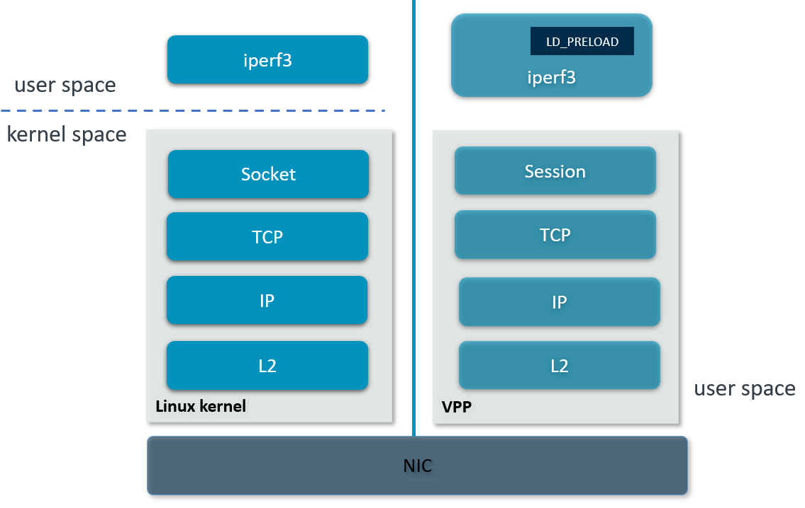

..
  # Copyright (c) 2023, Arm Limited.
  #
  # SPDX-License-Identifier: Apache-2.0

###################
VPP SSL PROXY
###################

************
Introduction
************

The SSL proxy controls Secure Sockets Layer – SSL traffic -to ensure secure
transmission of data between a client and a server. It acts as an intermediary,
performing SSL encryption and decryption between the client and the server.
For client, it acts as a server. For server, it acts as a client.

wrk2 is a modern HTTP benchmarking tool capable of generating significant load
when run on a single multi-core CPU. NGINX is open source software for web
serving, reverse proxying, caching, load balancing, media streaming, and more.

This guide explains in detail on how to integrate wrk2 and nginx with VPP's
host stack for ssl proxy cases. The integration is done via LD_PRELOAD which
intercepts syscalls that are supposed to go into the kernel and reinjects
them into VPP.

First, ensure the proper VPP binary and library path. To use VPP built in dataplane-stack, run::

        export vpp_binary="<nw_ds_workspace>/dataplane-stack/components/vpp/build-root/install-vpp-native/vpp/bin/vpp"
        export vppctl_binary="<nw_ds_workspace>/dataplane-stack/components/vpp/build-root/install-vpp-native/vpp/bin/vppctl"
        export LDP_PATH="<nw_ds_workspace>/dataplane-stack/components/vpp/build-root/install-vpp-native/vpp/lib/aarch64-linux-gnu/libvcl_ldpreload.so"

To use package intsalled VPP (e.g. ``apt``, ``buildroot``), run::

        export vpp_binary="vpp"
        export vppctl_binary="vppctl"
        export LDP_PATH="/system_lib_path/libvcl_ldpreload.so"

.. note::
        The system lib path can be ``/usr/lib`` or ``/usr/lib/aarch64-linux-gnu``.

********************
Network Stack Layers
********************

   Linux kernel stack VS VPP hoststack.

This guide demonstrates two kinds of ssl proxy connection:

- Loopback connection on one DUT
- RDMA ethernet connection between DUT and client/server

*******************
Loopback Connection
*******************

.. figure:: ../images/ssl_proxy_memif.png
   :align: center
   :width: 800

Setup
~~~~~

Download, patch, build wrk2 for aarch64::

        cd <nw_ds_workspace>/dataplane-stack
        git clone https://github.com/AmpereTravis/wrk2-aarch64.git
        cd wrk2-aarch64
        git am <nw_ds_workspace>/dataplane-stack/patches/ssl_proxy/0001-Modify-max-number-of-file-descriptors-tracked-to-run.patch
        make all
        export wrk=<nw_ds_workspace>/wrk2-aarch64/wrk

Create ssl private keys and certificates for nginx https proxy and server::

        sudo mkdir -p /etc/nginx/certs
        sudo openssl req -x509 -nodes -days 365 -newkey rsa:2048 -keyout /etc/nginx/certs/server.key -out /etc/nginx/certs/server.crt
        sudo openssl req -x509 -nodes -days 365 -newkey rsa:2048 -keyout /etc/nginx/certs/proxy.key -out /etc/nginx/certs/proxy.crt

.. note::

        You will be asked a series of questions in order to embed the information
        correctly in the certificate. Fill out the prompts appropriately.

Create config file ``nginx_server.conf`` for nginx https server::

        user www-data;
        worker_processes 1;
        worker_cpu_affinity 100;
        pid /run/nginx_server.pid;

        events {
        }

        http {
                sendfile on;
                tcp_nopush on;
                tcp_nodelay on;
                keepalive_requests 1000000000;

                default_type application/octet-stream;

                access_log off;
                error_log /dev/null crit;

                server {
                        listen 8443 ssl;
                        server_name $hostname;
                        ssl_protocols TLSv1.3;
                        ssl_prefer_server_ciphers on;
                        ssl_certificate /etc/nginx/certs/server.crt;
                        ssl_certificate_key /etc/nginx/certs/server.key;
                        ssl_conf_command Ciphersuites TLS_AES_128_GCM_SHA256;
                        root /var/www/html;

                        location / {
                                try_files $uri $uri/ =404;
                        }
                }
        }

Create config file ``nginx_proxy.conf`` for nginx https proxy::

        user www-data;
        worker_processes 1;
        worker_cpu_affinity 1000;
        pid /run/nginx_proxy.pid;

        events {
        }

        http {
                sendfile on;
                tcp_nopush on;
                tcp_nodelay on;
                keepalive_requests 1000000000;

                default_type application/octet-stream;

                access_log off;
                error_log /dev/null crit;

                upstream ssl_file_server_com {
                        server 172.16.1.1:8443;
                        keepalive 1024;
                }

                server {
                        listen 8089 ssl;
                        server_name $hostname;
                        ssl_protocols TLSv1.3;
                        ssl_prefer_server_ciphers on;
                        ssl_certificate /etc/nginx/certs/proxy.crt;
                        ssl_certificate_key /etc/nginx/certs/proxy.key;
                        ssl_conf_command Ciphersuites TLS_AES_128_GCM_SHA256;

                        location / {
                                limit_except GET {
                                deny all;
                                }
                                proxy_pass https://ssl_file_server_com;
                                proxy_http_version 1.1;
                                proxy_set_header Connection "";
                                proxy_ssl_protocols TLSv1.3;
                        }
                }
        }

For more detailed usage on above nginx configuration, refer to following links,

- `nginx core functionality reference`_
- `nginx http core module reference`_
- `nginx http upstream module reference`_
- `nginx http proxy module reference`_
- `nginx http ssl module reference`_

Create 1kb file in nginx https server root directory::

        sudo mkdir -p /var/www/html
        sudo dd if=/dev/urandom of=/var/www/html/1kb bs=1024 count=1

Start VPP as a daemon with config parameters and declare a variable with the VPP cli socket.
For more argument parameters, refer to `VPP configuration reference`_::

        sudo ${vpp_binary} unix {cli-listen /run/vpp/cli.sock} cpu {main-core 1 workers 0} tcp {cc-algo cubic} session {enable use-app-socket-api}
        export sockfile=/run/vpp/cli.sock

Create loopback interfaces and routes by following VPP commands::

        sudo ${vppctl_binary} -s ${sockfile} create loopback interface
        sudo ${vppctl_binary} -s ${sockfile} set interface state loop0 up
        sudo ${vppctl_binary} -s ${sockfile} create loopback interface
        sudo ${vppctl_binary} -s ${sockfile} set interface state loop1 up
        sudo ${vppctl_binary} -s ${sockfile} create loopback interface
        sudo ${vppctl_binary} -s ${sockfile} set interface state loop2 up
        sudo ${vppctl_binary} -s ${sockfile} ip table add 1
        sudo ${vppctl_binary} -s ${sockfile} set interface ip table loop0 1
        sudo ${vppctl_binary} -s ${sockfile} ip table add 2
        sudo ${vppctl_binary} -s ${sockfile} set interface ip table loop1 2
        sudo ${vppctl_binary} -s ${sockfile} ip table add 3
        sudo ${vppctl_binary} -s ${sockfile} set interface ip table loop2 3
        sudo ${vppctl_binary} -s ${sockfile} set interface ip address loop0 172.16.1.1/24
        sudo ${vppctl_binary} -s ${sockfile} set interface ip address loop1 172.16.2.1/24
        sudo ${vppctl_binary} -s ${sockfile} set interface ip address loop2 172.16.3.1/24
        sudo ${vppctl_binary} -s ${sockfile} app ns add id server secret 1234 sw_if_index 1
        sudo ${vppctl_binary} -s ${sockfile} app ns add id proxy secret 1234 sw_if_index 2
        sudo ${vppctl_binary} -s ${sockfile} app ns add id client secret 1234 sw_if_index 3
        sudo ${vppctl_binary} -s ${sockfile} ip route add 172.16.1.1/32 table 2 via lookup in table 1
        sudo ${vppctl_binary} -s ${sockfile} ip route add 172.16.3.1/32 table 2 via lookup in table 3
        sudo ${vppctl_binary} -s ${sockfile} ip route add 172.16.2.1/32 table 1 via lookup in table 2
        sudo ${vppctl_binary} -s ${sockfile} ip route add 172.16.2.1/32 table 3 via lookup in table 2

For more detailed usage on above commands, refer to following links,

- `VPP set interface ip address reference`_
- `VPP set interface state reference`_
- `VPP ip route reference`_
- `VPP app ns reference`_

Create VCL configuration files for wrk2 and nginx.

- For nginx https server ``vcl_nginx_server.conf``::

        vcl {
                heapsize 64M
                segment-size 4000000000
                add-segment-size 4000000000
                rx-fifo-size 4000000
                tx-fifo-size 4000000
                namespace-id server
                namespace-secret 1234
                app-scope-global
                app-socket-api /var/run/vpp/app_ns_sockets/server
        }

- For nginx https proxy ``vcl_nginx_proxy.conf``::

        vcl {
                heapsize 64M
                segment-size 4000000000
                add-segment-size 4000000000
                rx-fifo-size 4000000
                tx-fifo-size 4000000
                namespace-id proxy
                namespace-secret 1234
                app-scope-global
                app-socket-api /var/run/vpp/app_ns_sockets/proxy
        }

- For wrk2 https client ``vcl_wrk2.conf``::

        vcl {
                heapsize 64M
                segment-size 4000000000
                add-segment-size 4000000000
                rx-fifo-size 4000000
                tx-fifo-size 4000000
                namespace-id client
                namespace-secret 1234
                app-scope-global
                app-socket-api /var/run/vpp/app_ns_sockets/client
        }

The above configure vcl to request 4MB receive and transmit fifo sizes and access
to global session scope. Additionally, they provide the path to session layer's
different app namespace socket for wrk2 and nginx instances.

Declare a variable to hold the path to libvcl_ldpreload.so::

        export LDP_PATH=/path/to/libvcl_ldpreload.so

.. note::
        For VPP built in dataplane stack repo, libvcl_ldpreload.so path is <nw_ds_workspace>/dataplane-stack/components/vpp/build-root/install-vpp-native/vpp/lib/aarch64-linux-gnu/libvcl_ldpreload.so.

        For package installed VPP (e.g. ``apt``, ``buildroot``), libvcl_ldpreload.so path is is /usr/lib/libvcl_ldpreload.so or /usr/lib/aarch64-linux-gnu/libvcl_ldpreload.so by default.

Alternatively, for DUT with dataplane stack repo, user can run ``run_dut.sh -l`` to setup vpp::

        cd <nw_ds_workspace>/dataplane-stack
        ./usecase/tcp_term/run_dut.sh -l

.. note::

        Run ``./usecase/tcp_term/run_dut.sh --help`` for all supported options.

Test
~~~~

Start nginx https server over VPP's host stack::

        sudo taskset -c 2 sh -c "LD_PRELOAD=${LDP_PATH} VCL_CONFIG=/path/to/vcl_nginx_server.conf nginx -c /path/to/nginx_server.conf"

Start nginx https proxy over VPP's host stack::

        sudo taskset -c 3 sh -c "LD_PRELOAD=${LDP_PATH} VCL_CONFIG=/path/to/vcl_nginx_proxy.conf nginx -c /path/to/nginx_proxy.conf"

To examine the nginx sessions in VPP, run the command ``show session verbose``.
Here is a sample output for nginx sessions::

        // To be added
        sudo ${vppctl_binary} -s ${sockfile} show session verbose
        Connection                                                  State          Rx-f      Tx-f
        [0:0][T] 172.16.1.1:5201->0.0.0.0:0                         LISTEN         0         0
        Thread 0: active sessions 1

Start wrk2 client over VPP's host stack to test ssl proxy with a 1kb file::

        sudo taskset -c 4 sh -c "LD_PRELOAD=${LDP_PATH} VCL_CONFIG=/path/to/vcl_wrk2.conf /wrk --rate 100000000 -t 1 -c 10 -d 60s https://172.16.2.1:8089/1kb"

.. note::
        Extremely high rate (--rate) is used to ensure throughput is measured.
        Number of connections (-c) is set to 10 to produce high throughput.
        Test duration (-d) is 60 seconds which is a sufficient amount of time to get repeatable results.

Alternatively, for DUT with dataplane stack repo, user can run scripts to start the iperf3 server and client::

        cd <nw_ds_workspace>/dataplane-stack
        ./usecase/tcp_term/run_iperf3_server.sh -l
        ./usecase/tcp_term/run_iperf3_client.sh

If both wrk2 and nginx run successfully, wrk2 will print the measurement results::

        // to be added
        Connecting to host 172.16.1.1, port 5201
        [ 33] local 172.16.2.1 port 43757 connected to 172.16.1.1 port 5201
        [ ID] Interval           Transfer     Bitrate         Retr  Cwnd
        [ 33]   0.00-1.00   sec  2.23 GBytes  19.2 Gbits/sec  65535    555 MBytes
        [ 33]   1.00-2.00   sec  2.23 GBytes  19.2 Gbits/sec  4294901761   0.00 Bytes
        [ 33]   2.00-3.00   sec  2.23 GBytes  19.1 Gbits/sec  65535    555 MBytes
        [ 33]   3.00-4.00   sec  2.23 GBytes  19.2 Gbits/sec    0    555 MBytes
        [ 33]   4.00-5.00   sec  2.23 GBytes  19.2 Gbits/sec  4294901761   0.00 Bytes
        [ 33]   5.00-6.00   sec  2.23 GBytes  19.2 Gbits/sec  65535    555 MBytes
        [ 33]   6.00-7.00   sec  2.23 GBytes  19.2 Gbits/sec  4294901761   0.00 Bytes
        [ 33]   7.00-8.00   sec  2.23 GBytes  19.2 Gbits/sec  65535    555 MBytes
        [ 33]   8.00-9.00   sec  2.23 GBytes  19.2 Gbits/sec    0    555 MBytes
        [ 33]   9.00-10.00  sec  2.23 GBytes  19.2 Gbits/sec    0   -1874590816.00 Bytes
        - - - - - - - - - - - - - - - - - - - - - - - - -
        [ ID] Interval           Transfer     Bitrate         Retr
        [ 33]   0.00-10.00  sec  22.3 GBytes  19.2 Gbits/sec  65535             sender
        [ 33]   0.00-10.00  sec  22.3 GBytes  19.2 Gbits/sec                  receiver

Stop
~~~~

Kill VPP::

        $ sudo pkill -9 vpp

Kill nginx::

        $ sudo pkill -9 nginx

************************
RDMA Ethernet Connection
************************

This section assumes the following setup:

.. figure:: ../images/ssl_proxy_rdma.png
        :align: center
        :width: 800

As shown, the Device Under Test (DUT) should have at least one NIC connected to the client machine.
The DUT run iperf3 in server mode and the client machine run iperf3 in client mode.

Setup
~~~~~

Start vpp as a daemon with config parameters and define a variable with the vpp cli listen socket::

        sudo ${vpp_binary} unix {cli-listen /run/vpp/cli.sock} cpu {main-core 1 workers 0} tcp {cc-algo cubic} session {enable use-app-socket-api}
        export sockfile=/run/vpp/cli.sock

Get interface name from lshw command::

        sudo lshw -c net -businfo
        Bus info          Device      Class      Description
        ====================================================
        pci@0000:07:00.0  eth0        network    RTL8111/8168/8411 PCI Express Gigabit Ethernet Controller
        pci@0001:01:00.0  enP1p1s0f0  network    MT27800 Family [ConnectX-5]
        pci@0001:01:00.1  enP1p1s0f1  network    MT27800 Family [ConnectX-5]

Select appropriate interface to create rdma interface and set ip address::

        sudo ${vppctl_binary} -s ${sockfile} create interface rdma host-if enP1p1s0f0 name eth0
        sudo ${vppctl_binary} -s ${sockfile} set interface ip address eth0 1.1.1.2/30
        sudo ${vppctl_binary} -s ${sockfile} set interface state eth0 up

Create a VCL configuration file for iperf3 server instance ``vcl_iperf3_server.conf``::

        vcl {
             rx-fifo-size 4000000
             tx-fifo-size 4000000
             app-scope-global
             app-socket-api /var/run/vpp/app_ns_sockets/default
           }

The above configure vcl to request 4MB receive and transmit fifo sizes and access to global session scope.

Test
~~~~

Define following variable with the appropriate path::

        export LDP_PATH=/path/to/libvcl_ldpreload.so

.. note::
        For DUT with dataplane stack repo, libvcl_ldpreload.so path is <nw_ds_workspace>/dataplane-stack/components/vpp/build-root/install-vpp-native/vpp/lib/aarch64-linux-gnu/libvcl_ldpreload.so.

        For DUT with VPP package installed (e.g. ``apt``), libvcl_ldpreload.so path is is /usr/lib/libvcl_ldpreload.so by default.

On DUT start the iperf3 server as a daemon over VPP host stack::

        sudo taskset -c 2 sh -c "LD_PRELOAD=${LDP_PATH} VCL_CONFIG=/path/to/vcl_iperf3_server.conf iperf3 -4 -s -D"

On client machine start the iperf3 client to connect to iperf3 server::

        sudo taskset -c 3 iperf3 -c 1.1.1.2

.. note::
        ``-c`` stand for core-list, make sure that the core-list is such selected that it does not overlap VPP's cores but it maintains the same NUMA node.

If both iperf3 client and server run successfully, the measurement results will be printed::

        Connecting to host 172.16.1.1, port 5201
        [ 33] local 172.16.2.1 port 43757 connected to 172.16.1.1 port 5201
        [ ID] Interval           Transfer     Bitrate         Retr  Cwnd
        [ 33]   0.00-1.00   sec  2.23 GBytes  19.2 Gbits/sec  65535    555 MBytes
        [ 33]   1.00-2.00   sec  2.23 GBytes  19.2 Gbits/sec  4294901761   0.00 Bytes
        [ 33]   2.00-3.00   sec  2.23 GBytes  19.1 Gbits/sec  65535    555 MBytes
        [ 33]   3.00-4.00   sec  2.23 GBytes  19.2 Gbits/sec    0    555 MBytes
        [ 33]   4.00-5.00   sec  2.23 GBytes  19.2 Gbits/sec  4294901761   0.00 Bytes
        [ 33]   5.00-6.00   sec  2.23 GBytes  19.2 Gbits/sec  65535    555 MBytes
        [ 33]   6.00-7.00   sec  2.23 GBytes  19.2 Gbits/sec  4294901761   0.00 Bytes
        [ 33]   7.00-8.00   sec  2.23 GBytes  19.2 Gbits/sec  65535    555 MBytes
        [ 33]   8.00-9.00   sec  2.23 GBytes  19.2 Gbits/sec    0    555 MBytes
        [ 33]   9.00-10.00  sec  2.23 GBytes  19.2 Gbits/sec    0   -1874590816.00 Bytes
        - - - - - - - - - - - - - - - - - - - - - - - - -
        [ ID] Interval           Transfer     Bitrate         Retr
        [ 33]   0.00-10.00  sec  22.3 GBytes  19.2 Gbits/sec  65535             sender
        [ 33]   0.00-10.00  sec  22.3 GBytes  19.2 Gbits/sec                  receiver

If want to run iperf3 over kernel stack, start iperf3 server on DUT::

        iperf3 -4 -s D

And then, start iperf3 client on client machine::

        iperf3 -c ${DUT_ip_address}

.. note::
        ``DUT_ip_address:`` DUT's ip address.

Stop
~~~~

Kill vpp::

        sudo pkill -9 vpp

Kill iperf3 server::

        sudo pkill -9 iperf3

********************
Tips for performance
********************

For jumbo packets, increase vpp tcp mtu and buffer size to improve the performance.
Below is vpp example config::

        tcp {
            cc-algo cubic
            mtu 9000
        }
        buffers {
            default data-size 10000
        }

*********
Resources
*********

#. `VPP configuration reference <https://s3-docs.fd.io/vpp/22.02/configuration/reference.html>`_
#. `VPP set interface ip address reference <https://s3-docs.fd.io/vpp/22.02/cli-reference/clis/clicmd_src_vnet_ip.html#set-interface-ip-address>`_
#. `VPP set interface state reference <https://s3-docs.fd.io/vpp/22.02/cli-reference/clis/clicmd_src_vnet.html#set-interface-state>`_
#. `VPP ip route reference <https://s3-docs.fd.io/vpp/22.02/cli-reference/clis/clicmd_src_vnet_ip.html#ip-route>`_
#. `VPP app ns reference <https://s3-docs.fd.io/vpp/22.02/cli-reference/clis/clicmd_src_vnet_session.html#app-ns>`_
#. `VPP cli reference <https://s3-docs.fd.io/vpp/22.02/cli-reference/index.html>`_
#. `iperf3 usage reference <https://software.es.net/iperf/invoking.html>`_
#. `nginx core functionality reference <https://nginx.org/en/docs/ngx_core_module.html>`_
#. `nginx http core module reference <https://nginx.org/en/docs/http/ngx_http_core_module.html>`_
#. `nginx http upstream module reference <https://nginx.org/en/docs/http/ngx_http_upstream_module.html>`_
#. `nginx http proxy module reference <https://nginx.org/en/docs/http/ngx_http_proxy_module.html>`_
#. `nginx http ssl module reference <https://nginx.org/en/docs/http/ngx_http_ssl_module.html>`_
