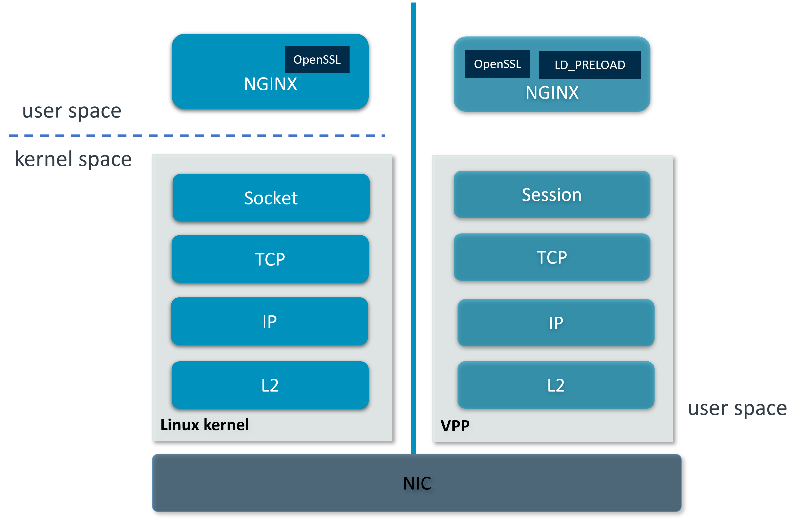
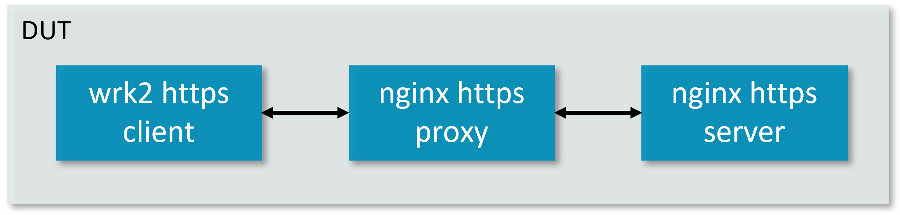
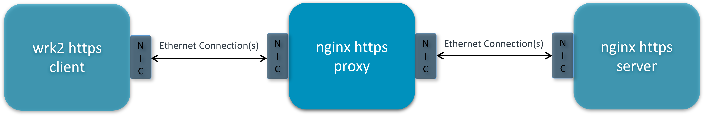

..
  # Copyright (c) 2023, Arm Limited.
  #
  # SPDX-License-Identifier: Apache-2.0

#########
SSL PROXY
#########

************
Introduction
************

The SSL proxy controls Secure Sockets Layer – SSL traffic -to ensure secure
transmission of data between a client and a server. It acts as an intermediary,
performing SSL encryption and decryption between the client and the server.
For client, it acts as a server. For server, it acts as a client.

wrk2 is a modern HTTP benchmarking tool capable of generating significant load
when run on a single multi-core CPU. NGINX is open source software for web
serving, reverse proxying, caching, load balancing, media streaming, and more.

This guide explains in detail on how to integrate wrk2 and NGINX with VPP's
host stack for ssl proxy cases. The integration is done via LD_PRELOAD which
intercepts syscalls that are supposed to go into the kernel and reinjects
them into VPP.

First, ensure the proper VPP binary and library path on DUT. To use VPP built in dataplane-stack repo, run::

        export vpp_binary="<nw_ds_workspace>/dataplane-stack/components/vpp/build-root/install-vpp-native/vpp/bin/vpp"
        export vppctl_binary="<nw_ds_workspace>/dataplane-stack/components/vpp/build-root/install-vpp-native/vpp/bin/vppctl"
        export LDP_PATH="<nw_ds_workspace>/dataplane-stack/components/vpp/build-root/install-vpp-native/vpp/lib/aarch64-linux-gnu/libvcl_ldpreload.so"

To use package intsalled VPP (e.g. ``apt``, ``buildroot``), run::

        export vpp_binary="vpp"
        export vppctl_binary="vppctl"
        export LDP_PATH="/system_lib_path/libvcl_ldpreload.so"

.. note::
        The system lib path can be ``/usr/lib`` or ``/usr/lib/aarch64-linux-gnu``.

********************
Network Stack Layers
********************

   Linux kernel stack VS VPP's host stack

This guide demonstrates two kinds of ssl proxy connection:

- Loopback connection on one DUT
- RDMA ethernet connection between DUT and client/server nodes

*******************
Loopback Connection
*******************

.. note::
        This setup requires 4 isolated cpu cores. On platforms without enough
        isolated cores, degraded performance can be observed.

Script Running
==============

Users can run scripts in dataplane-stack repo to setup DUT and test ssl proxy case
over loopback connection quickly::

        cd <nw_ds_workspace>/dataplane-stack
        ./usecase/ssl_proxy/run_dut.sh -l -c 1

.. note::
        You will be asked a series of questions in order to embed the information
        correctly in the certificate. Fill out the prompts appropriately.

        ./usecase/ssl_proxy/run_nginx_server.sh -l -c 2
        ./usecase/ssl_proxy/run_nginx_proxy.sh -c 3 
        ./usecase/ssl_proxy/run_wrk2.sh -c 4 

.. note::
        Run ``./usecase/ssl_proxy/run_dut.sh --help`` for all supported options.

If the case runs successfully, the measurement results will be printed::

        Initialised 1 threads in 0 ms.
        Running 10s test @ https://172.16.2.1:8089/1kb
          1 threads and 10 connections
          Thread Stats   Avg      Stdev     Max   +/- Stdev
            Latency     5.00s     2.87s    9.99s    57.76%
            Req/Sec        nan       nan   0.00      0.00%
          750658 requests in 10.00s, 0.89GB read
        Requests/sec:  75065.43
        Transfer/sec:     91.49MB

Stop case::

        ./usecase/ssl_proxy/stop.sh

CLI Running
===========

Users can also follow below step by step instructions to setup wrk2, NGINX, VPP
and run ssl proxy over loopback connection on DUT.

DUT Setup
~~~~~~~~~

If no package installed wrk2 available, download, patch, and build wrk2 for aarch64
platform firstly::

        cd <nw_ds_workspace>/dataplane-stack/components
        git clone https://github.com/AmpereTravis/wrk2-aarch64.git
        cd wrk2-aarch64
        git am <nw_ds_workspace>/dataplane-stack/patches/wrk2/0001-wrk2-fd-vpp.patch
        make all
        export wrk=<nw_ds_workspace>/wrk2-aarch64/wrk

Create ssl private keys and certificates for NGINX https proxy and server::

        sudo mkdir -p /etc/nginx/certs
        sudo openssl req -x509 -nodes -days 365 -newkey rsa:2048 -keyout /etc/nginx/certs/server.key -out /etc/nginx/certs/server.crt
        sudo openssl req -x509 -nodes -days 365 -newkey rsa:2048 -keyout /etc/nginx/certs/proxy.key -out /etc/nginx/certs/proxy.crt

.. note::

        You will be asked a series of questions in order to embed the information
        correctly in the certificate. Fill out the prompts appropriately.

Create NGINX config file ``nginx_server.conf`` for NGINX https server::

        user www-data;
        worker_processes 1;
        pid /run/nginx_server.pid;

        events {
        }

        http {
                sendfile on;
                tcp_nopush on;
                tcp_nodelay on;
                keepalive_requests 1000000000;

                default_type application/octet-stream;

                access_log off;
                error_log /dev/null crit;

                server {
                        listen 8445 ssl;
                        server_name $hostname;
                        ssl_protocols TLSv1.3;
                        ssl_prefer_server_ciphers on;
                        ssl_certificate /etc/nginx/certs/server.crt;
                        ssl_certificate_key /etc/nginx/certs/server.key;
                        ssl_conf_command Ciphersuites TLS_AES_128_GCM_SHA256;
                        root /var/www/html;

                        location / {
                                try_files $uri $uri/ =404;
                        }
                }
        }

Create NGINX config file ``nginx_proxy.conf`` for NGINX https proxy::

        user www-data;
        worker_processes 1;
        pid /run/nginx_proxy.pid;

        events {
        }

        http {
                sendfile on;
                tcp_nopush on;
                tcp_nodelay on;
                keepalive_requests 1000000000;

                default_type application/octet-stream;

                access_log off;
                error_log /dev/null crit;

                upstream ssl_file_server_com {
                        server 172.16.1.1:8445;
                        keepalive 1024;
                }

                server {
                        listen 8089 ssl;
                        server_name $hostname;
                        ssl_protocols TLSv1.3;
                        ssl_prefer_server_ciphers on;
                        ssl_certificate /etc/nginx/certs/proxy.crt;
                        ssl_certificate_key /etc/nginx/certs/proxy.key;
                        ssl_conf_command Ciphersuites TLS_AES_128_GCM_SHA256;

                        location / {
                                limit_except GET {
                                deny all;
                                }
                                proxy_pass https://ssl_file_server_com;
                                proxy_http_version 1.1;
                                proxy_set_header Connection "";
                                proxy_ssl_protocols TLSv1.3;
                        }
                }
        }

.. note::
        The https server ip address is used as the upstream server in ``nginx_proxy.conf`` file.

For more detailed usage on above NGINX configuration, refer to following links,

- `nginx core functionality reference`_
- `nginx http core module reference`_
- `nginx http upstream module reference`_
- `nginx http proxy module reference`_
- `nginx http ssl module reference`_

Create 1kb file in NGINX https server root directory::

        sudo mkdir -p /var/www/html
        sudo dd if=/dev/urandom of=/var/www/html/1kb bs=1024 count=1

Start VPP as a daemon with config parameters and declare a variable with the VPP cli socket.
For more argument parameters, refer to `VPP configuration reference`_::

        sudo ${vpp_binary} unix {cli-listen /run/vpp/cli.sock} cpu {main-core 1 workers 0} tcp {cc-algo cubic} session {enable use-app-socket-api}
        export sockfile="/run/vpp/cli.sock"

Create loopback interfaces and routes by following VPP commands::

        sudo ${vppctl_binary} -s ${sockfile} create loopback interface
        sudo ${vppctl_binary} -s ${sockfile} set interface state loop0 up
        sudo ${vppctl_binary} -s ${sockfile} create loopback interface
        sudo ${vppctl_binary} -s ${sockfile} set interface state loop1 up
        sudo ${vppctl_binary} -s ${sockfile} create loopback interface
        sudo ${vppctl_binary} -s ${sockfile} set interface state loop2 up
        sudo ${vppctl_binary} -s ${sockfile} ip table add 1
        sudo ${vppctl_binary} -s ${sockfile} set interface ip table loop0 1
        sudo ${vppctl_binary} -s ${sockfile} ip table add 2
        sudo ${vppctl_binary} -s ${sockfile} set interface ip table loop1 2
        sudo ${vppctl_binary} -s ${sockfile} ip table add 3
        sudo ${vppctl_binary} -s ${sockfile} set interface ip table loop2 3
        sudo ${vppctl_binary} -s ${sockfile} set interface ip address loop0 172.16.1.1/24
        sudo ${vppctl_binary} -s ${sockfile} set interface ip address loop1 172.16.2.1/24
        sudo ${vppctl_binary} -s ${sockfile} set interface ip address loop2 172.16.3.1/24
        sudo ${vppctl_binary} -s ${sockfile} app ns add id server secret 1234 sw_if_index 1
        sudo ${vppctl_binary} -s ${sockfile} app ns add id proxy secret 1234 sw_if_index 2
        sudo ${vppctl_binary} -s ${sockfile} app ns add id client secret 1234 sw_if_index 3
        sudo ${vppctl_binary} -s ${sockfile} ip route add 172.16.1.1/32 table 2 via lookup in table 1
        sudo ${vppctl_binary} -s ${sockfile} ip route add 172.16.3.1/32 table 2 via lookup in table 3
        sudo ${vppctl_binary} -s ${sockfile} ip route add 172.16.2.1/32 table 1 via lookup in table 2
        sudo ${vppctl_binary} -s ${sockfile} ip route add 172.16.2.1/32 table 3 via lookup in table 2

For more detailed usage on above commands, refer to following links,

- `VPP set interface ip address reference`_
- `VPP set interface state reference`_
- `VPP ip route reference`_
- `VPP app ns reference`_

Create VCL configuration files for wrk2 and NGINX instances.

- For NGINX https server ``vcl_nginx_server.conf``::

        vcl {
          heapsize 64M
          segment-size 4000000000
          add-segment-size 4000000000
          rx-fifo-size 4000000
          tx-fifo-size 4000000
          namespace-id server
          namespace-secret 1234
          app-scope-global
          app-socket-api /var/run/vpp/app_ns_sockets/server
        }

- For NGINX https proxy ``vcl_nginx_proxy.conf``::

        vcl {
          heapsize 64M
          segment-size 4000000000
          add-segment-size 4000000000
          rx-fifo-size 4000000
          tx-fifo-size 4000000
          namespace-id proxy
          namespace-secret 1234
          app-scope-global
          app-socket-api /var/run/vpp/app_ns_sockets/proxy
        }

- For wrk2 https client ``vcl_wrk2.conf``::

        vcl {
          heapsize 64M
          segment-size 4000000000
          add-segment-size 4000000000
          rx-fifo-size 4000000
          tx-fifo-size 4000000
          namespace-id client
          namespace-secret 1234
          app-scope-global
          app-socket-api /var/run/vpp/app_ns_sockets/client
        }

The above configure vcl to request 4MB receive and transmit fifo sizes and access
to global session scope. Additionally, they provide the path to session layer's
different app namespace socket for wrk2 and NGINX instances.

Test
~~~~

Start NGINX https server on port 8445 over VPP's host stack::

        sudo taskset -c 2 sh -c "LD_PRELOAD=${LDP_PATH} VCL_CONFIG=/path/to/vcl_nginx_server.conf nginx -c /path/to/nginx_server.conf"

Start NGINX https proxy on port 8089 over VPP's host stack::

        sudo taskset -c 3 sh -c "LD_PRELOAD=${LDP_PATH} VCL_CONFIG=/path/to/vcl_nginx_proxy.conf nginx -c /path/to/nginx_proxy.conf"

To examine the NGINX sessions in VPP, run the command ``show session verbose``.
Here is a sample output for NGINX sessions::

        sudo ${vppctl_binary} -s ${sockfile} show session verbose
        Connection                                                  State          Rx-f      Tx-f
        [0:0][T] 172.16.2.1:8089->0.0.0.0:0                         LISTEN         0         0
        [0:1][T] 172.16.1.1:8445->0.0.0.0:0                         LISTEN         0         0
        Thread 0: active sessions 2

Start wrk2 client over VPP's host stack to test ssl proxy with 1kb file downloading::

        sudo taskset -c 4 sh -c "LD_PRELOAD=${LDP_PATH} VCL_CONFIG=/path/to/vcl_wrk2.conf wrk --rate 100000000 -t 1 -c 10 -d 10s https://172.16.2.1:8089/1kb"

.. note::
        Extremely high rate (--rate) is used to ensure throughput is measured.
        Number of connections (-c) is set to 10 to produce high throughput.
        Test duration (-d) is 10 seconds.
        Url is ssl proxy's url.

If both wrk2 and NGINX run successfully, wrk2 will output similar results as in
the script running section.

Stop
~~~~

Kill VPP::

        $ sudo pkill -9 vpp

Kill NGINX::

        $ sudo pkill -9 nginx

************************
RDMA Ethernet Connection
************************

This section will create this setup:

As shown, the DUT should have one NIC interface connected to the NGINX https server node,
and another NIC interface connected to the wrk2 https client node.

To find out which DUT interfaces are connected with https client/server nodes,
``sudo ethtool --identify <interface_name>`` will typically blink a light on the NIC to help identify the
physical port associated with the interface.

Get interface names ``enP1p1s0f0`` and ``enP1p1s0f1`` from ``lshw`` command::

        sudo lshw -c net -businfo
        Bus info          Device      Class      Description
        ====================================================
        pci@0000:07:00.0  eth0        network    RTL8111/8168/8411 PCI Express Gigabit Ethernet Controller
        pci@0001:01:00.0  enP1p1s0f0  network    MT27800 Family [ConnectX-5]
        pci@0001:01:00.1  enP1p1s0f1  network    MT27800 Family [ConnectX-5]

In this setup example, DUT interface ``enP1p1s0f0`` is connected to NGINX https
server node, and ``enP1p1s0f1`` is connected to wrk2 https client node.

.. note::
        The https server node's ip address should match upstream server config in
        NGINX config ``nginx_proxy.conf`` on proxy DUT, which is 172.16.1.1 in
        this setup example.

Script Running
==============

On DUT run scripts in dataplane-stack repo to setup DUT and run NGINX https proxy
on port 8089 over VPP's host stack::

        cd <nw_ds_workspace>/dataplane-stack
        ./usecase/ssl_proxy/run_dut.sh -p enP1p1s0f0,enP1p1s0f1 -c 1,2
        ./usecase/ssl_proxy/run_nginx_proxy.sh -c 3 

On https server node run script in dataplane-stack repo to start NGINX https server
on port 8445::

        cd <nw_ds_workspace>/dataplane-stack
        ./usecase/ssl_proxy/run_nginx_server.sh -p

On https client node download, build, and run wrk2 to test ssl proxy::

        x86: git clone https://github.com/giltene/wrk2.git && cd wrk2
        OR
        aarch64: git clone https://github.com/AmpereTravis/wrk2-aarch64.git && cd wrk2-aarch64
        make all
        sudo taskset -c 1 ./wrk --rate 100000000 -t 1 -c 10 -d 10s https://172.16.2.1:8089/1kb"
 
If the case runs successfully, the measurement results will be output by wrk client::

        Initialised 1 threads in 0 ms.
        Running 10s test @ https://172.16.2.1:8089/1kb
          1 threads and 10 connections
          Thread Stats   Avg      Stdev     Max   +/- Stdev
            Latency     5.01s     2.88s    9.99s    57.66%
            Req/Sec        nan       nan   0.00      0.00%
          424079 requests in 10.00s, 516.87MB read
        Requests/sec:  42406.22
        Transfer/sec:     51.68MB

Stop case::

        ./usecase/ssl_proxy/stop.sh

CLI Running
===========

Users can also follow below step by step instructions to setup wrk2, NGINX, VPP
and run ssl proxy over RDMA ethernet connection between DUT and https client/server nodes.

DUT Setup
~~~~~~~~~

Start vpp as a daemon with config parameters and declare a variable with the vpp cli socket::

        sudo ${vpp_binary} unix {cli-listen /run/vpp/cli.sock} cpu {main-core 1 workers 0} tcp {cc-algo cubic} session {enable use-app-socket-api}
        export sockfile="/run/vpp/cli.sock"

Create rdma ethernet interfaces and set ip addresses::

        sudo ${vppctl_binary} -s ${sockfile} create interface rdma host-if enP1p1s0f0 name eth0
        sudo ${vppctl_binary} -s ${sockfile} set interface ip address eth0 172.16.1.2/30
        sudo ${vppctl_binary} -s ${sockfile} set interface state eth0 up
        sudo ${vppctl_binary} -s ${sockfile} create interface rdma host-if enP1p1s0f1 name eth1
        sudo ${vppctl_binary} -s ${sockfile} set interface ip address eth1 172.16.2.1/30
        sudo ${vppctl_binary} -s ${sockfile} set interface state eth1 up

Create a VCL configuration file for nginx https proxy ``vcl_nginx_proxy_pn.conf``::

        vcl {
          heapsize 64M
          segment-size 4000000000
          add-segment-size 4000000000
          rx-fifo-size 4000000
          tx-fifo-size 4000000
          app-socket-api /var/run/vpp/app_ns_sockets/default
        }

The above configures vcl to request 4MB receive and transmit fifo sizes and it
provides the path to vpp's session layer socket api.

Create ssl private key and certificate for nginx https proxy::

        sudo mkdir -p /etc/nginx/certs
        sudo openssl req -x509 -nodes -days 365 -newkey rsa:2048 -keyout /etc/nginx/certs/proxy.key -out /etc/nginx/certs/proxy.crt

Create nginx config file ``nginx_proxy.conf`` for nginx https proxy. It is same
as the ``nginx_proxy.conf`` in loopback connection section. 

Start nginx https proxy over VPP's host stack::

        sudo taskset -c 2 sh -c "LD_PRELOAD=${LDP_PATH} VCL_CONFIG=/path/to/vcl_nginx_proxy_pn.conf nginx -c /path/to/nginx_proxy.conf"

To examine the nginx proxy session in VPP, run the command ``show session verbose``.
Here is a sample output for nginx proxy session::

        sudo ${vppctl_binary} -s ${sockfile} show session verbose
        Connection                                                  State          Rx-f      Tx-f
        [0:0][T] 0.0.0.0:8089->0.0.0.0:0                         LISTEN         0         0
        Thread 0: active sessions 1 

Test
~~~~

On https server node create ssl private key and certificate for NGINX https server::

        sudo mkdir -p /etc/nginx/certs
        sudo openssl req -x509 -nodes -days 365 -newkey rsa:2048 -keyout /etc/nginx/certs/server.key -out /etc/nginx/certs/server.crt

Create NGINX config file ``nginx_server.conf`` for NGINX https server. It is same
as the ``nginx_server.conf`` in loopback connection section. 

Create 1kb file in NGINX https server root directory::

        sudo mkdir -p /var/www/html
        sudo dd if=/dev/urandom of=/var/www/html/1kb bs=1024 count=1

Start NGINX https server::

        sudo taskset -c 1 nginx -c /path/to/nginx_server.conf

Refer to wrk2 part in script running section to run wrk2 on client node to test ssl proxy.

Stop
~~~~

Kill VPP on DUT::

        sudo pkill -9 vpp

Kill NGINX on DUT and https server node::

        sudo pkill -9 nginx

*********
Resources
*********

#. `VPP configuration reference <https://s3-docs.fd.io/vpp/22.02/configuration/reference.html>`_
#. `VPP set interface ip address reference <https://s3-docs.fd.io/vpp/22.02/cli-reference/clis/clicmd_src_vnet_ip.html#set-interface-ip-address>`_
#. `VPP set interface state reference <https://s3-docs.fd.io/vpp/22.02/cli-reference/clis/clicmd_src_vnet.html#set-interface-state>`_
#. `VPP ip route reference <https://s3-docs.fd.io/vpp/22.02/cli-reference/clis/clicmd_src_vnet_ip.html#ip-route>`_
#. `VPP app ns reference <https://s3-docs.fd.io/vpp/22.02/cli-reference/clis/clicmd_src_vnet_session.html#app-ns>`_
#. `VPP cli reference <https://s3-docs.fd.io/vpp/22.02/cli-reference/index.html>`_
#. `iperf3 usage reference <https://software.es.net/iperf/invoking.html>`_
#. `nginx core functionality reference <https://nginx.org/en/docs/ngx_core_module.html>`_
#. `nginx http core module reference <https://nginx.org/en/docs/http/ngx_http_core_module.html>`_
#. `nginx http upstream module reference <https://nginx.org/en/docs/http/ngx_http_upstream_module.html>`_
#. `nginx http proxy module reference <https://nginx.org/en/docs/http/ngx_http_proxy_module.html>`_
#. `nginx http ssl module reference <https://nginx.org/en/docs/http/ngx_http_ssl_module.html>`_
If the case runs successfully, the measurement results will be output by wrk client::

        Initialised 1 threads in 0 ms.
        Running 10s test @ https://172.16.2.1:8089/1kb
          1 threads and 10 connections
          Thread Stats   Avg      Stdev     Max   +/- Stdev
            Latency     5.01s     2.88s    9.99s    57.66%
            Req/Sec        nan       nan   0.00      0.00%
          424079 requests in 10.00s, 516.87MB read
        Requests/sec:  42406.22
        Transfer/sec:     51.68MB

Stop case::

        ./usecase/ssl_proxy/stop.sh

CLI Running
===========

Users can also follow below step by step instructions to setup wrk2, NGINX, VPP
and run ssl proxy over RDMA ethernet connection between DUT and https client/server nodes.

DUT Setup
~~~~~~~~~

Start vpp as a daemon with config parameters and declare a variable with the vpp cli socket::

        sudo ${vpp_binary} unix {cli-listen /run/vpp/cli.sock} cpu {main-core 1 workers 0} tcp {cc-algo cubic} session {enable use-app-socket-api}
        export sockfile="/run/vpp/cli.sock"

Create rdma ethernet interfaces and set ip addresses::

        sudo ${vppctl_binary} -s ${sockfile} create interface rdma host-if enP1p1s0f0 name eth0
        sudo ${vppctl_binary} -s ${sockfile} set interface ip address eth0 172.16.1.2/30
        sudo ${vppctl_binary} -s ${sockfile} set interface state eth0 up
        sudo ${vppctl_binary} -s ${sockfile} create interface rdma host-if enP1p1s0f1 name eth1
        sudo ${vppctl_binary} -s ${sockfile} set interface ip address eth1 172.16.2.1/30
        sudo ${vppctl_binary} -s ${sockfile} set interface state eth1 up

Create a VCL configuration file for nginx https proxy ``vcl_nginx_proxy_pn.conf``::

        vcl {
          heapsize 64M
          segment-size 4000000000
          add-segment-size 4000000000
          rx-fifo-size 4000000
          tx-fifo-size 4000000
          app-socket-api /var/run/vpp/app_ns_sockets/default
        }

The above configures vcl to request 4MB receive and transmit fifo sizes and it
provides the path to vpp's session layer socket api.

Create ssl private key and certificate for nginx https proxy::

        sudo mkdir -p /etc/nginx/certs
        sudo openssl req -x509 -nodes -days 365 -newkey rsa:2048 -keyout /etc/nginx/certs/proxy.key -out /etc/nginx/certs/proxy.crt

Create nginx config file ``nginx_proxy.conf`` for nginx https proxy. It is same
as the ``nginx_proxy.conf`` in loopback connection section. 

Start nginx https proxy over VPP's host stack::

        sudo taskset -c 2 sh -c "LD_PRELOAD=${LDP_PATH} VCL_CONFIG=/path/to/vcl_nginx_proxy_pn.conf nginx -c /path/to/nginx_proxy.conf"

To examine the nginx proxy session in VPP, run the command ``show session verbose``.
Here is a sample output for nginx proxy session::

        sudo ${vppctl_binary} -s ${sockfile} show session verbose
        Connection                                                  State          Rx-f      Tx-f
        [0:0][T] 0.0.0.0:8089->0.0.0.0:0                         LISTEN         0         0
        Thread 0: active sessions 1 

Test
~~~~

On https server node create ssl private key and certificate for NGINX https server::

        sudo mkdir -p /etc/nginx/certs
        sudo openssl req -x509 -nodes -days 365 -newkey rsa:2048 -keyout /etc/nginx/certs/server.key -out /etc/nginx/certs/server.crt

Create NGINX config file ``nginx_server.conf`` for NGINX https server. It is same
as the ``nginx_server.conf`` in loopback connection section. 

Create 1kb file in NGINX https server root directory::

        sudo mkdir -p /var/www/html
        sudo dd if=/dev/urandom of=/var/www/html/1kb bs=1024 count=1

Start NGINX https server::

        sudo taskset -c 1 nginx -c /path/to/nginx_server.conf

Refer to wrk2 part in script running section to run wrk2 on client node to test ssl proxy.

Stop
~~~~

Kill VPP on DUT::

        sudo pkill -9 vpp

Kill NGINX on DUT and https server node::

        sudo pkill -9 nginx

*********
Resources
*********

#. `VPP configuration reference <https://s3-docs.fd.io/vpp/22.02/configuration/reference.html>`_
#. `VPP set interface ip address reference <https://s3-docs.fd.io/vpp/22.02/cli-reference/clis/clicmd_src_vnet_ip.html#set-interface-ip-address>`_
#. `VPP set interface state reference <https://s3-docs.fd.io/vpp/22.02/cli-reference/clis/clicmd_src_vnet.html#set-interface-state>`_
#. `VPP ip route reference <https://s3-docs.fd.io/vpp/22.02/cli-reference/clis/clicmd_src_vnet_ip.html#ip-route>`_
#. `VPP app ns reference <https://s3-docs.fd.io/vpp/22.02/cli-reference/clis/clicmd_src_vnet_session.html#app-ns>`_
#. `VPP cli reference <https://s3-docs.fd.io/vpp/22.02/cli-reference/index.html>`_
#. `iperf3 usage reference <https://software.es.net/iperf/invoking.html>`_
#. `nginx core functionality reference <https://nginx.org/en/docs/ngx_core_module.html>`_
#. `nginx http core module reference <https://nginx.org/en/docs/http/ngx_http_core_module.html>`_
#. `nginx http upstream module reference <https://nginx.org/en/docs/http/ngx_http_upstream_module.html>`_
#. `nginx http proxy module reference <https://nginx.org/en/docs/http/ngx_http_proxy_module.html>`_
#. `nginx http ssl module reference <https://nginx.org/en/docs/http/ngx_http_ssl_module.html>`_
