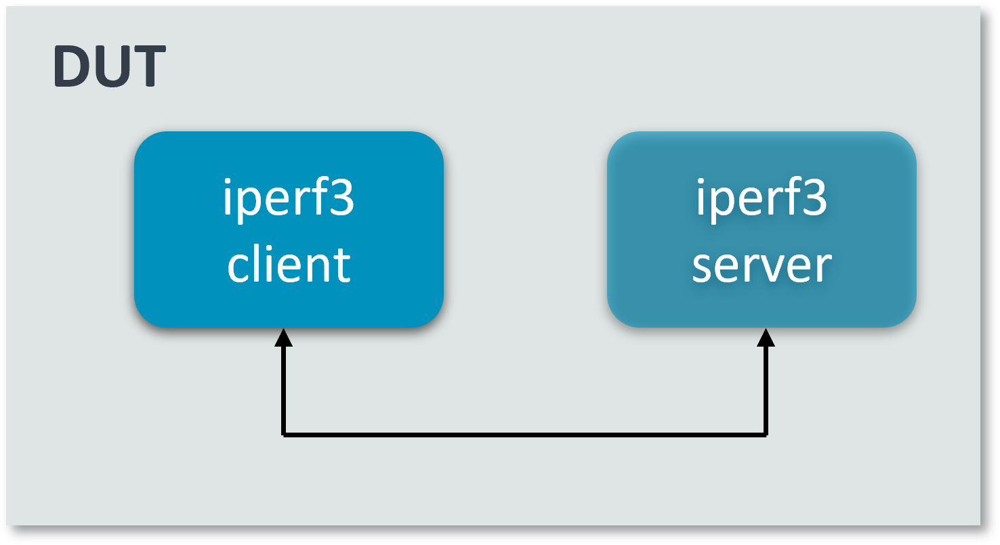
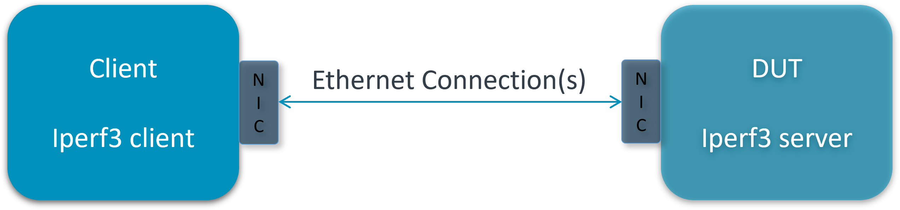

..
  # Copyright (c) 2022, Arm Limited.
  #
  # SPDX-License-Identifier: Apache-2.0

###################
VPP TCP Termination
###################

************
Introduction
************

VPP's host stack is a user space implementation of a number of transport,
session and application layer protocols. It leverages VPP’s graph based
forwarding model and vectorized packet processing to ensure high throughput
and scale transport protocol termination.

iperf3 is a tool for active measurements of the maximum achievable bandwidth on IP networks.

This guide explains in detail on how to integrate iperf3 with VPP's host stack
for tcp termination cases. The integration is done via LD_PRELOAD which
intercepts syscalls that are supposed to go into the kernel and reinjects
them into VPP.

First, ensure the proper VPP binary path. To use VPP built in dataplane-stack, run::

        export vpp_binary="<nw_ds_workspace>/dataplane-stack/components/vpp/build-root/install-vpp-native/vpp/bin/vpp"
        export vppctl_binary="<nw_ds_workspace>/dataplane-stack/components/vpp/build-root/install-vpp-native/vpp/bin/vppctl"

To use package intsalled VPP (e.g. ``apt``), run::

        export vpp_binary="vpp"
        export vppctl_binary="vppctl"

********************
Network Stack Layers
********************

.. figure:: ../images/kernel-vpp-stack.png
   :align: center

   Linux kernel stack VS VPP hoststack.

This guide demonstrates two kinds of iperf3 connection:

- Loopback connection on one DUT
- RDMA ethernet connection between DUT and client

*******************
Loopback Connection
*******************

Setup
~~~~~

Start VPP as a daemon with config parameters and define a variable with the VPP cli socket.
For more argument parameters, refer to `VPP configuration reference`_::

        sudo ${vpp_binary} unix {cli-listen /run/vpp/cli.sock} cpu {main-core 1 workers 0} tcp {cc-algo cubic} session {enable use-app-socket-api}
        export sockfile=/run/vpp/cli.sock

Create loopback interfaces and routes by following VPP commands::

        sudo ${vppctl_binary} -s ${sockfile} create loopback interface
        sudo ${vppctl_binary} -s ${sockfile} set interface state loop0 up
        sudo ${vppctl_binary} -s ${sockfile} create loopback interface
        sudo ${vppctl_binary} -s ${sockfile} set interface state loop1 up
        sudo ${vppctl_binary} -s ${sockfile} ip table add 1
        sudo ${vppctl_binary} -s ${sockfile} set interface ip table loop0 1
        sudo ${vppctl_binary} -s ${sockfile} ip table add 2
        sudo ${vppctl_binary} -s ${sockfile} set interface ip table loop1 2
        sudo ${vppctl_binary} -s ${sockfile} set interface ip address loop0 172.16.1.1/24
        sudo ${vppctl_binary} -s ${sockfile} set interface ip address loop1 172.16.2.1/24
        sudo ${vppctl_binary} -s ${sockfile} app ns add id foo secret 1234 sw_if_index 1
        sudo ${vppctl_binary} -s ${sockfile} app ns add id bar secret 5678 sw_if_index 2
        sudo ${vppctl_binary} -s ${sockfile} ip route add 172.16.1.1/32 table 2 via lookup in table 1
        sudo ${vppctl_binary} -s ${sockfile} ip route add 172.16.2.1/32 table 1 via lookup in table 2

For more detailed usage on above commands, refer to following links,

- `VPP set interface ip address reference`_
- `VPP set interface state reference`_
- `VPP ip route reference`_

Alternatively, for DUT with dataplane stack repo, user can run ``run_dut.sh -l`` to setup vpp::

        cd <nw_ds_workspace>/dataplane-stack
        ./usecase/tcp_term/run_dut.sh -l

.. note::

        Run ``./usecase/tcp_term/run_dut.sh --help`` for all supported options.

Test
~~~~

Create two VCL configuration file for iperf3 instances.

- For server instance ``vcl_iperf3_server.conf``::

        vcl {
          rx-fifo-size 4000000
          tx-fifo-size 4000000
          namespace-id foo
          namespace-secret 1234
          app-scope-global
          app-socket-api /var/run/vpp/app_ns_sockets/foo
        }

- For client instance ``vcl_iperf3_client.conf``::

        vcl {
          rx-fifo-size 4000000
          tx-fifo-size 4000000
          namespace-id bar
          namespace-secret 5678
          app-scope-global
          app-socket-api /var/run/vpp/app_ns_sockets/bar
        }

The above configure vcl to request 4MB receive and transmit fifo sizes and access to global session scope.
Additionally, it provides the path to session layer's different app namespace socket for iperf3 client and server instances.

Before start iperf3 define following variable with the appropriate path::

        export LDP_PATH=/path/to/libvcl_ldpreload.so

.. note::
        For DUT with dataplane stack repo, libvcl_ldpreload.so path is <nw_ds_workspace>/dataplane-stack/components/vpp/build-root/install-vpp-native/vpp/lib/aarch64-linux-gnu/libvcl_ldpreload.so.

        For DUT with VPP package installed (e.g. ``apt``), libvcl_ldpreload.so path is is /usr/lib/libvcl_ldpreload.so by default.

To start the iperf3 server over VPP's host stack as a daemon::

        sudo taskset -c 2 sh -c "LD_PRELOAD=${LDP_PATH} VCL_CONFIG=/path/to/vcl_iperf3_server.conf iperf3 -4 -s -D"

To examine the iperf3 server session in VPP, use the command ``show session verbose``.
Here is a sample output for iperf3 server session::

        sudo /path/to/vppctl -s ${sockfile} show session verbose
        Connection                                                  State          Rx-f      Tx-f
        [0:0][T] 172.16.1.1:5201->0.0.0.0:0                         LISTEN         0         0
        Thread 0: active sessions 1

To start the iperf3 client over VPP host stack to connect to iperf3 server::

        sudo taskset -c 3 sh -c "LD_PRELOAD=${LDP_PATH} VCL_CONFIG=/path/to/vcl_iperf3_client.conf iperf3 -c 172.16.1.1"

.. note::
        ``-c`` stand for core-list, make sure that the core-list is such selected that it does not overlap VPP's cores but it maintains the same NUMA node.

Alternatively, for DUT with dataplane stack repo, user can run scripts to start the iperf3 server and client::

        cd <nw_ds_workspace>/dataplane-stack
        ./usecase/tcp_term/run_iperf3_server.sh -l
        ./usecase/tcp_term/run_iperf3_client.sh

If both iperf3 client and server run successfully, the measurement results will be printed::

        Connecting to host 172.16.1.1, port 5201
        [ 33] local 172.16.2.1 port 43757 connected to 172.16.1.1 port 5201
        [ ID] Interval           Transfer     Bitrate         Retr         Cwnd
        [ 33]   0.00-1.00   sec  2.23 GBytes  19.2 Gbits/sec  65535        555 MBytes
        [ 33]   1.00-2.00   sec  2.23 GBytes  19.2 Gbits/sec  4294901761   0.00 Bytes
        [ 33]   2.00-3.00   sec  2.23 GBytes  19.1 Gbits/sec  65535        555 MBytes
        [ 33]   3.00-4.00   sec  2.23 GBytes  19.2 Gbits/sec    0          555 MBytes
        [ 33]   4.00-5.00   sec  2.23 GBytes  19.2 Gbits/sec  4294901761   0.00 Bytes
        [ 33]   5.00-6.00   sec  2.23 GBytes  19.2 Gbits/sec  65535        555 MBytes
        [ 33]   6.00-7.00   sec  2.23 GBytes  19.2 Gbits/sec  4294901761   0.00 Bytes
        [ 33]   7.00-8.00   sec  2.23 GBytes  19.2 Gbits/sec  65535        555 MBytes
        [ 33]   8.00-9.00   sec  2.23 GBytes  19.2 Gbits/sec    0          555 MBytes
        [ 33]   9.00-10.00  sec  2.23 GBytes  19.2 Gbits/sec    0          -1874590816.00 Bytes
        - - - - - - - - - - - - - - - - - - - - - - - - -
        [ ID] Interval           Transfer     Bitrate         Retr
        [ 33]   0.00-10.00  sec  22.3 GBytes  19.2 Gbits/sec  65535             sender
        [ 33]   0.00-10.00  sec  22.3 GBytes  19.2 Gbits/sec                  receiver

For more detailed iperf3 usage, refer to following link,

- `iperf3 usage reference`_

Run over Kernel stack is simpler than VPP stack.
First, start iperf3 serevr::

        $ iperf3 -4 -s -D

And then, start iperf3 client connect to server::

        $ iperf3 -c 127.0.0.1

Stop
~~~~

Kill vpp::

        $ sudo pkill -9 vpp

Kill iperf3 server::

        $ sudo pkill -9 iperf3

************************
RDMA Ethernet Connection
************************

This section assumes the following setup:

As shown, the Device Under Test (DUT) should have at least one NIC connected to the client machine.
The DUT run iperf3 in server mode and the client machine run iperf3 in client mode.

Setup
~~~~~

Start vpp as a daemon with config parameters and define a variable with the vpp cli listen socket::

        sudo ${vpp_binary} unix {cli-listen /run/vpp/cli.sock} cpu {main-core 1 workers 0} tcp {cc-algo cubic} session {enable use-app-socket-api}
        export sockfile=/run/vpp/cli.sock

Get interface name from lshw command::

        sudo lshw -c net -businfo
        Bus info          Device      Class      Description
        ====================================================
        pci@0000:07:00.0  eth0        network    RTL8111/8168/8411 PCI Express Gigabit Ethernet Controller
        pci@0001:01:00.0  enP1p1s0f0  network    MT27800 Family [ConnectX-5]
        pci@0001:01:00.1  enP1p1s0f1  network    MT27800 Family [ConnectX-5]

Select appropriate interface to create rdma interface and set ip address::

        sudo ${vppctl_binary} -s ${sockfile} create interface rdma host-if enP1p1s0f0 name eth0
        sudo ${vppctl_binary} -s ${sockfile} set interface ip address eth0 1.1.1.2/30
        sudo ${vppctl_binary} -s ${sockfile} set interface state eth0 up

Create a VCL configuration file for iperf3 server instance ``vcl_iperf3_server.conf``::

        vcl {
             rx-fifo-size 4000000
             tx-fifo-size 4000000
             app-scope-global
             app-socket-api /var/run/vpp/app_ns_sockets/default
           }

The above configure vcl to request 4MB receive and transmit fifo sizes and access to global session scope.

Test
~~~~

Define following variable with the appropriate path::

        export LDP_PATH=/path/to/libvcl_ldpreload.so

.. note::
        For DUT with dataplane stack repo, libvcl_ldpreload.so path is <nw_ds_workspace>/dataplane-stack/components/vpp/build-root/install-vpp-native/vpp/lib/aarch64-linux-gnu/libvcl_ldpreload.so.

        For DUT with VPP package installed (e.g. ``apt``), libvcl_ldpreload.so path is is /usr/lib/libvcl_ldpreload.so by default.

On DUT start the iperf3 server as a daemon over VPP host stack::

        sudo taskset -c 2 sh -c "LD_PRELOAD=${LDP_PATH} VCL_CONFIG=/path/to/vcl_iperf3_server.conf iperf3 -4 -s -D"

On client machine start the iperf3 client to connect to iperf3 server::

        sudo taskset -c 3 iperf3 -c 1.1.1.2

.. note::
        ``-c`` stand for core-list, make sure that the core-list is such selected that it does not overlap VPP's cores but it maintains the same NUMA node.

If both iperf3 client and server run successfully, the measurement results will be printed::

        Connecting to host 1.1.1.2, port 5201
        [  5] local 1.1.1.1 port 59118 connected to 1.1.1.2 port 5201
        [ ID] Interval           Transfer     Bitrate         Retr  Cwnd
        [  5]   0.00-1.00   sec  1.85 GBytes  15.9 Gbits/sec  183   1.39 MBytes
        [  5]   1.00-2.00   sec  1.85 GBytes  15.9 Gbits/sec   44   1.37 MBytes
        [  5]   2.00-3.00   sec  1.85 GBytes  15.9 Gbits/sec   26   1.35 MBytes
        [  5]   3.00-4.00   sec  1.85 GBytes  15.9 Gbits/sec   33   1.54 MBytes
        [  5]   4.00-5.00   sec  1.85 GBytes  15.9 Gbits/sec   42   1.64 MBytes
        [  5]   5.00-6.00   sec  1.84 GBytes  15.8 Gbits/sec  110   1.35 MBytes
        [  5]   6.00-7.00   sec  1.85 GBytes  15.9 Gbits/sec   24   1.54 MBytes
        [  5]   7.00-8.00   sec  1.84 GBytes  15.8 Gbits/sec   35   1.38 MBytes
        [  5]   8.00-9.00   sec  1.85 GBytes  15.9 Gbits/sec   27   1.21 MBytes
        [  5]   9.00-10.00  sec  1.85 GBytes  15.9 Gbits/sec   21   1.41 MBytes
        - - - - - - - - - - - - - - - - - - - - - - - - -
        [ ID] Interval           Transfer     Bitrate         Retr
        [  5]   0.00-10.00  sec  18.5 GBytes  15.9 Gbits/sec  545             sender
        [  5]   0.00-10.00  sec  18.5 GBytes  15.9 Gbits/sec                  receiver

If want to run iperf3 over kernel stack, start iperf3 server on DUT::

        iperf3 -4 -s D

And then, start iperf3 client on client machine::

        iperf3 -c ${DUT_ip_address}

.. note::
        ``DUT_ip_address:`` DUT's ip address.

Stop
~~~~

Kill vpp::

        sudo pkill -9 vpp

Kill iperf3 server::

        sudo pkill -9 iperf3

********************
Tips for performance
********************

For jumbo packets, increase vpp tcp mtu and buffer size to improve the performance.
Below is vpp example config::

        tcp {
            cc-algo cubic
            mtu 9000
        }
        buffers {
            default data-size 10000
        }

*********
Resources
*********

#. `VPP configuration reference <https://s3-docs.fd.io/vpp/22.02/configuration/reference.html>`_
#. `VPP set interface ip address reference <https://s3-docs.fd.io/vpp/22.02/cli-reference/clis/clicmd_src_vnet_ip.html#set-interface-ip-address>`_
#. `VPP set interface state reference <https://s3-docs.fd.io/vpp/22.02/cli-reference/clis/clicmd_src_vnet.html#set-interface-state>`_
#. `VPP ip route reference <https://s3-docs.fd.io/vpp/22.02/cli-reference/clis/clicmd_src_vnet_ip.html#ip-route>`_
#. `VPP cli reference <https://s3-docs.fd.io/vpp/22.02/cli-reference/index.html>`_
#. `iperf3 usage reference <https://software.es.net/iperf/invoking.html>`_
